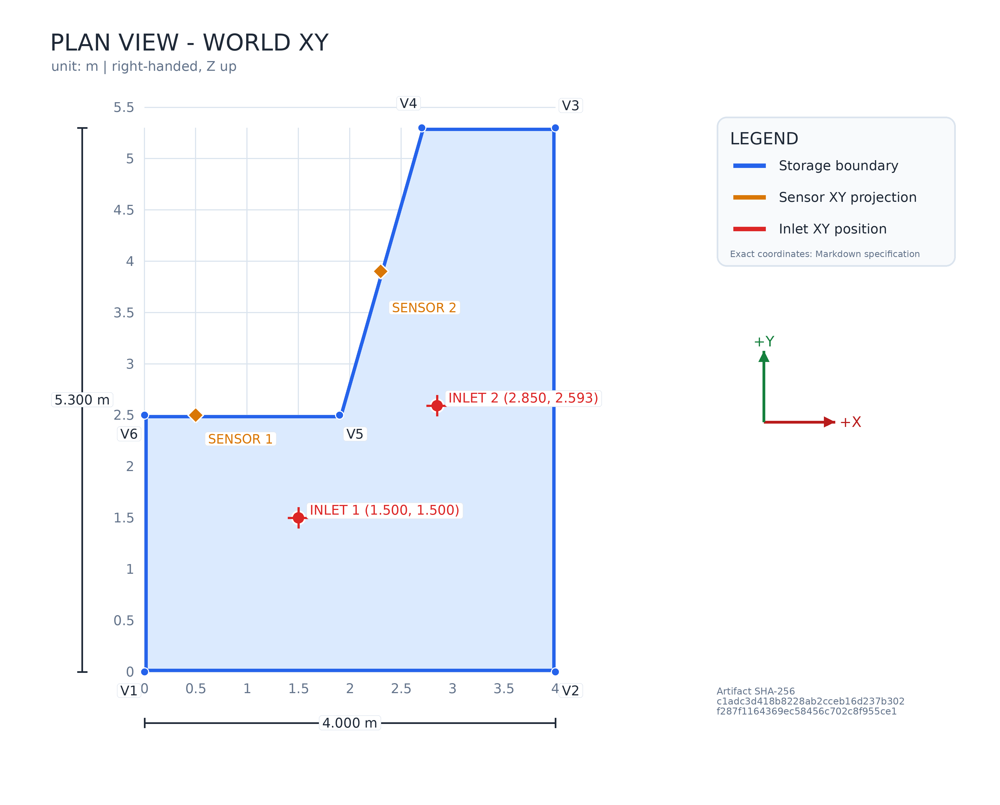
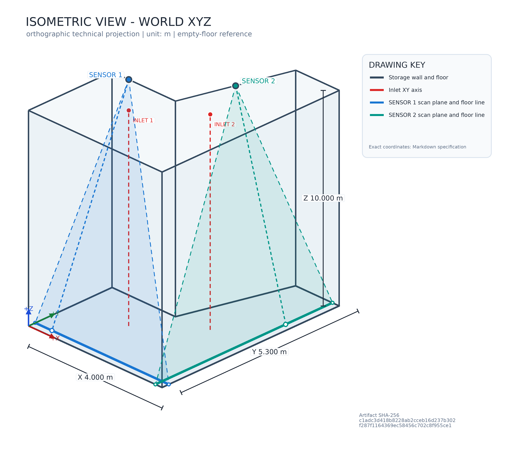

# 공개 합성 LiDAR 시뮬레이션 환경 규격

이 문서는 합성 통합 검증에 사용하는 공간, 센서 설치, 시나리오와 측정 설정의 자기완결 전달 문서다. 실제 현장 정보는 포함하지 않는다. 수치 정본은 문서 하단에 수록한 versioned JSON 3개다.

Input fingerprint SHA-256: `c32cf15d35bea83279c938c0dd4971835494072b4d94835675f4fb4c9c6b9adc`

Artifact fingerprint SHA-256: `c1adc3d418b8228ab2cceb16d237b302f287f1164369ec58456c702c8f955ce1`

## 도면





도면은 형상과 배치 관계를 보여준다. 정확한 값은 아래 표와 JSON을 사용한다.

## 좌표계

World XYZ는 오른손 좌표계다. X와 Y는 바닥 평면이고 +Z는 바닥에서 상단을 향한다. 거리 단위는 m이고 각도 단위는 deg다.

```text
direction(angle) = cos(angle) * u0 + sin(angle) * u90
world_point = p0 + distance * direction(angle)
rotation_axis = u0 x u90
scan_plane(a, b) = p0 + a * u0 + b * u90
```

`p0`는 센서 측정 원점이다. `u0`는 0 deg 광선 방향이고 `u90`은 90 deg 광선 방향이다. 회전축은 오른손 기준 `u0 x u90`이다.

## 적재 공간

| 항목 | 값 |
| --- | --- |
| Environment ID | `synthetic-scrap-pit-v1` |
| X 범위 | 0.000 - 4.000 m |
| Y 범위 | 0.000 - 5.300 m |
| 바닥 Z | 0.000 m |
| 외벽 상단 Z | 10.000 m |
| 유효 높이 | 10.000 m |
| 평면 면적 | 14.760 m2 |
| 전체 용량 | 147.600 m3 |

경계 꼭짓점은 V1부터 순서대로 연결하고 마지막 V6을 V1에 연결한다.

| 꼭짓점 | World X m | World Y m |
| --- | ---: | ---: |
| V1 | 0 | 0 |
| V2 | 4 | 0 |
| V3 | 4 | 5.3 |
| V4 | 2.7 | 5.3 |
| V5 | 1.9 | 2.5 |
| V6 | 0 | 2.5 |

## 투입구

투입구 설정은 적재 표면 부피 증가의 중심인 World XY만 정의한다. Z 위치와 컨베이어 형상은 정의하지 않는다.

| 투입구 | World X m | World Y m | 설정 배열 index |
| --- | ---: | ---: | ---: |
| INLET 1 | 1.5 | 1.5 | 0 |
| INLET 2 | 2.85 | 2.593 | 1 |

## 센서 설치와 바닥 측정선

바닥 측정선은 센서 회전면과 `Z = floor_z_m` 평면의 교선을 적재 공간 경계로 자른 선분이다.

| 센서 | 원점 p0 m | 0 deg 방향 u0 | 90 deg 방향 u90 | 회전축 u0 x u90 |
| --- | --- | --- | --- | --- |
| `lidar_1` | [0.5, 2.5, 10] | [0, -0.224147692921427, -0.9745551866149] | [-1, 0, 0] | [0, 0.9745551866149, -0.224147692921427] |
| `lidar_2` | [2.3, 3.9, 10] | [0.148340452930245, 0, -0.988936352868298] | [0, -1, 0] | [-0.988936352868298, 0, -0.148340452930245] |

| 센서 | 0 deg 바닥 교점 m | 바닥 교선 시작 m | 바닥 교선 끝 m |
| --- | --- | --- | --- |
| `lidar_1` | [0.5, 0.2, 0] | [4, 0.2, 0] | [0, 0.2, 0] |
| `lidar_2` | [3.8, 3.9, 0] | [3.8, 5.3, 0] | [3.8, 0, 0] |

## 정확한 입력 데이터

### 환경과 센서 설치

Source: `examples/environment.v1.json`

```json
{
  "environment_id": "synthetic-scrap-pit-v1",
  "length_unit": "m",
  "angle_unit": "deg",
  "boundary_xy_m": [
    [
      0,
      0
    ],
    [
      4,
      0
    ],
    [
      4,
      5.3
    ],
    [
      2.7,
      5.3
    ],
    [
      1.9,
      2.5
    ],
    [
      0,
      2.5
    ]
  ],
  "floor_z_m": 0,
  "top_z_m": 10,
  "sensors": [
    {
      "sensor_id": "lidar_1",
      "p0_m": [
        0.5,
        2.5,
        10
      ],
      "u0": [
        0,
        -0.22414769292142694,
        -0.9745551866148997
      ],
      "u90": [
        -1,
        0,
        0
      ]
    },
    {
      "sensor_id": "lidar_2",
      "p0_m": [
        2.3,
        3.9,
        10
      ],
      "u0": [
        0.14834045293024462,
        0,
        -0.9889363528682975
      ],
      "u90": [
        0,
        -1,
        0
      ]
    }
  ]
}
```

### 생성 시나리오와 측정 모델

Source: `examples/simulator.v2.json`

```json
{
  "config_version": 2,
  "seed": 123456789,
  "environment_path": "environment.v1.json",
  "quality_profile_path": "quality-profile.v1.json",
  "scenario": {
    "mean_fill_duration_s": 86400,
    "fill_duration_factor_range": [
      0.8,
      1.2
    ],
    "fill_rate_factor_range": [
      0.5,
      1.5
    ],
    "fill_rate_change_duration_s_range": [
      300,
      900
    ],
    "collection_threshold_range": [
      0.85,
      0.95
    ],
    "collection_duration_factor_range": [
      0.03333333333333333,
      0.05
    ],
    "collection_rate_factor_range": [
      0.3,
      1.7
    ],
    "collection_rate_change_duration_s_range": [
      60,
      180
    ],
    "inlet_positions_xy_m": [
      [
        1.5,
        1.5
      ],
      [
        2.85,
        2.593
      ]
    ],
    "inlet_switch_activation_ratio": 0.5,
    "inlet_switch_height_difference_m": 0.25,
    "inlet_comparison_radius_m": 0.5,
    "surface": {
      "cell_size_m": 0.25,
      "update_interval_s": 0.5,
      "pile_spread_radius_m": 0.5,
      "roughness_height_range_m": [
        -0.2,
        0.2
      ],
      "roughness_radius_range_m": [
        0.1,
        0.3
      ]
    }
  },
  "measurement": {
    "sample_rate_hz": 32000,
    "rotation_rate_hz": 10,
    "min_distance_m": 0.05,
    "max_distance_m": 30,
    "distance_noise": {
      "enabled": true,
      "standard_deviation_m": 0.01,
      "limit_m": 0.03
    },
    "distortions": {
      "falling_material": {
        "enabled": true,
        "event_rate_per_s": 0.5,
        "radius_m_range": [
          0.025,
          0.1
        ],
        "duration_s_range": [
          0.05,
          0.2
        ],
        "distance_reduction_m_range": [
          0.5,
          2
        ]
      },
      "voids": {
        "enabled": true,
        "surface_area_ratio": 0.03,
        "radius_m_range": [
          0.015,
          0.06
        ],
        "duration_s_range": [
          60,
          300
        ],
        "cover_height_increase_m": 0.1,
        "distance_increase_m_range": [
          0.05,
          0.3
        ]
      },
      "collection_occlusion": {
        "enabled": true,
        "event_interval_s_range": [
          20,
          40
        ],
        "radius_m_range": [
          0.15,
          0.5
        ],
        "duration_s_range": [
          2,
          8
        ],
        "distance_reduction_m_range": [
          0.5,
          2
        ]
      },
      "reflection_error": {
        "enabled": true,
        "probability": 0.001,
        "distance_reduction_m_range": [
          0.5,
          2
        ]
      },
      "dropout": {
        "enabled": false,
        "event_interval_s_range": [
          120,
          240
        ],
        "duration_s_range": [
          2,
          5
        ]
      }
    }
  },
  "observation_transport": {
    "connect_timeout_s": 3,
    "send_timeout_s": 2,
    "reconnect_initial_delay_s": 0.5,
    "reconnect_max_delay_s": 5
  },
  "diagnostics": {
    "enabled": true,
    "output_path": "diagnostics",
    "sample_scan_limit_per_sensor": 2
  }
}
```

### 적재 표면 계산 정책

| 항목 | 값 |
| --- | ---: |
| 합성 안식각 | 35.000 deg |
| 경사 이완 반복 상한 | 32 |

### 센서별 품질 분포

Source: `examples/quality-profile.v1.json`

```json
{
  "config_version": 1,
  "sensors": [
    {
      "sensor_id": "lidar_1",
      "valid_distance_frequencies": {
        "48": 1,
        "80": 3
      },
      "invalid_distance_frequencies": {
        "0": 2,
        "24": 1
      }
    },
    {
      "sensor_id": "lidar_2",
      "valid_distance_frequencies": {
        "48": 1,
        "80": 3
      },
      "invalid_distance_frequencies": {
        "0": 2,
        "24": 1
      }
    }
  ]
}
```
